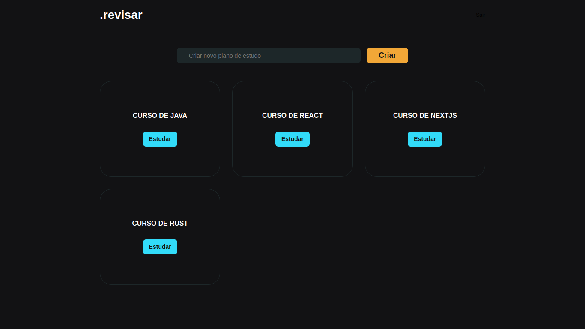

# Revisar

## Descrição
Revisar é um app de estudo baseado no método de estudo por cartões com pergunta de um lado e responsta do outro.




## Status:
 - Terminado(v1)

## Ferramentas
- Next.js
- Typescript
- Sass
- React-Card-flip
- React-dnd
- Prisma

## Como usar

Faça o clone deste repositório em sua máquina.

```bash
    git clone https://github.com/Ramiro-Rfn/revisar.git

````

Instale as dependências rodando:
```bash
    yarn 

    //ou

    npm install
````

Rode o progecto:
```bash
    yarn dev
``